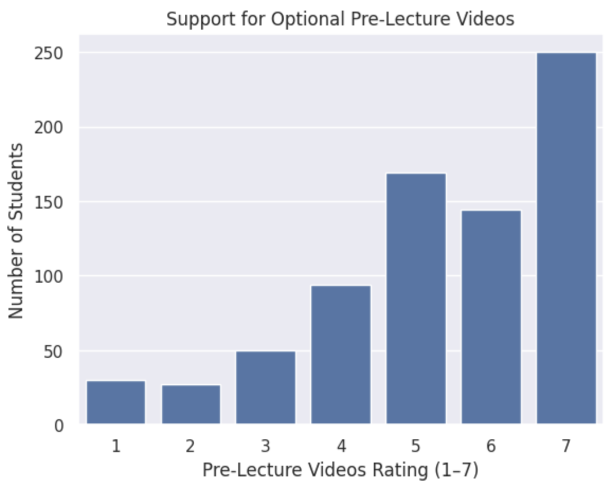
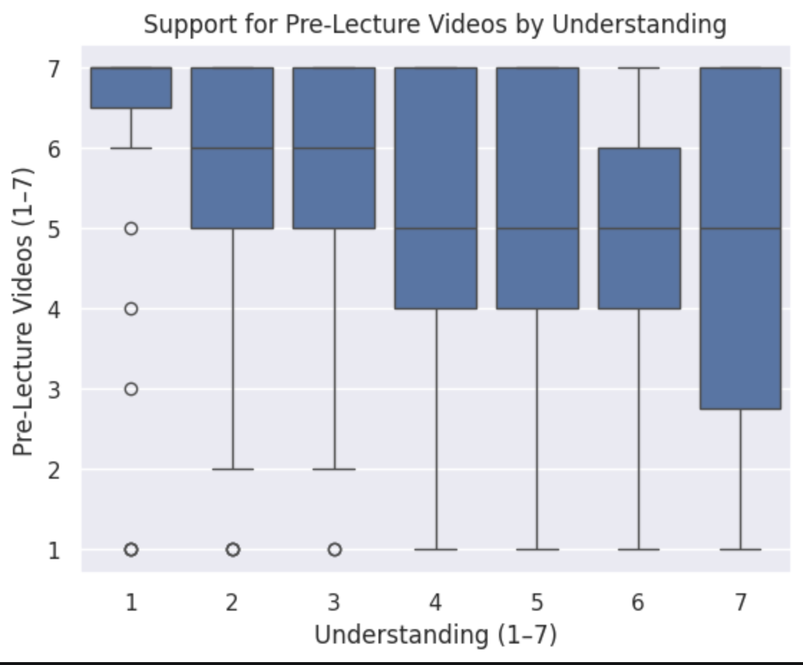
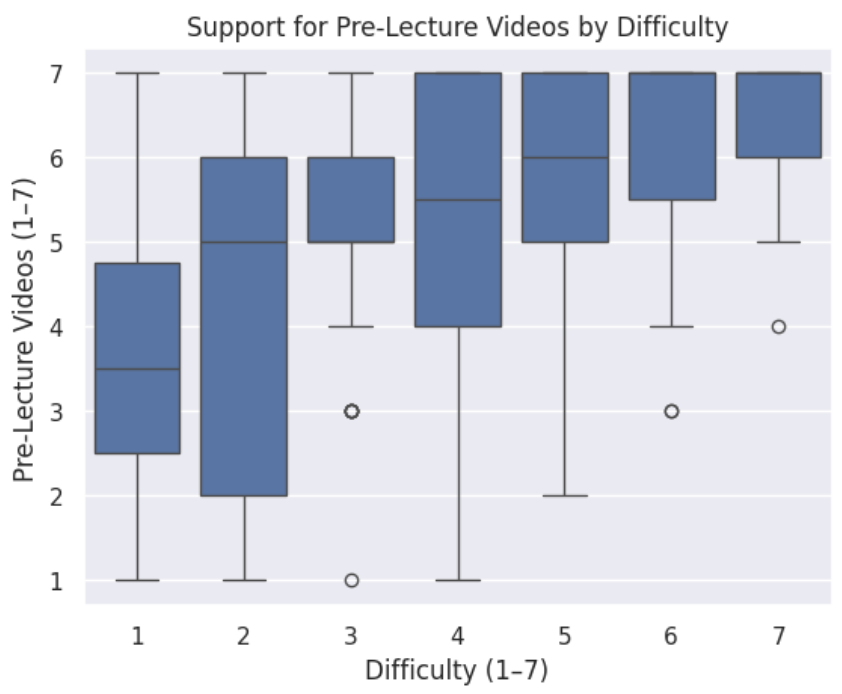

# EX09: Data Analysis for Continuous Improvement

## Idea
I analyzed whether optional pre-lecture videos would improve student learning in COMP110. I chose this idea because the survey includes direct data about student opinions on pre-lecture videos, making it possible to analyze using real data.

## Analysis Summary
I examined student responses about pre-lecture videos and compared them to measures such as understanding and difficulty.

The data shows that many students rated pre-lecture videos highly, suggesting strong interest in this resource. Additionally, students across different levels of understanding and difficulty also tended to support pre-lecture videos. Support remains consistently high across these groups, indicating that pre-lecture videos could be helpful for a wide range of students, including those who may be struggling.

## Visualizations

## Conclusion
Overall, the data supports the idea that optional pre-lecture videos would create value for students in COMP110. They could help students come to class better prepared and provide additional support for those who need it.

However, there are trade-offs. Creating pre-lecture videos would require additional time and effort from instructional staff, and not all students may use them. There is also a possibility that adding more resources could overwhelm students if expectations are not clearly communicated.

In the future, it would be useful to collect data after implementing pre-lecture videos to determine their actual impact on student learning, understanding, and performance.